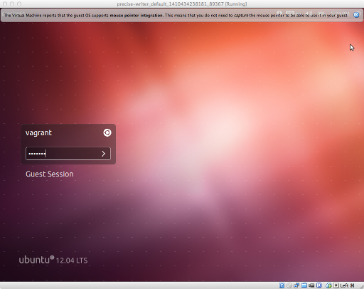

# hmt-vm

A virtual machine for editorial work on Homer Multitext project.

## Prerequisites ##

- vagrant: <http://www.vagrantup.com>
- virtualbox: <https://www.virtualbox.org/>

If you want to verify that you have installed the prerequisites correctly, try out this simple example of a virtual machine:

    vagrant init ubuntu/trusty64
    vagrant up

## Initial build of HMT VM ##

From a terminal in the directory where you have checked out this repository:

    vagrant up

1. Wait until the (long!) initial build has completed. This will build, but not start the Desktop GUI.
2. Run `vagrant halt`. The next time you run `vagrant up`, the system will start a graphic interface.

To login to the graphic interface, use the login window (shown below) to login as the user `vagrant`, with password `vagrant`.

Once you are logged on, you'll see on the Desktop of your virtual machine a folder named "shared":   the contents of this folder are also available in your host operating system.

In the lower left corner of the screen, there is a popup menu with shortcuts to several applications. You can open a terminal on the guest machine from the "Accessories" menu as  illustrated here.

To complete your initial set up, you can either open a terminal in the virtual machine, or from a terminal in your host system, connect to the virtual machine with ssh:

    vagrant ssh

and run 

    sh /vagrant/scripts/refresh-hmt.sh

This will clone all the repositories you need to edit HMT material, and will build the morphological parsing system.  (The initial cloning and building are slow.)

## Regular usage ##

You may work either in the virtual machine's graphic interface, or from a terminal in your host system.

### From the VM's graphic interface ##

Login as `vagrant`

### From your host operating system

Connect to the virtual machine with ssh:

    vagrant ssh

### Continue in either environment

Work in the directory shared between the virtual machine and your host machine:

    cd /vagrant

Update all HMT repositories in the virtual machine:

    sh /vagrant/scripts/refresh-hmt.sh

## More information ##

See the [guides for editors and contributors][guides] on the HMT project web site.

[guides]: http://www.homermultitext.org/hmt-docs/guides/

    

